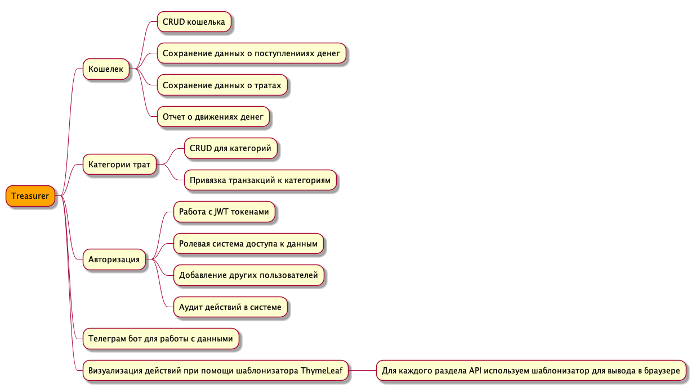

# 1. Интро

## Описание проекта

В рамках этого проекта мы будем делать приложение для домашнего учета финансов. В ходе задания мы делать допущения для упрощения реализации, так как проект является учебным. Основной целью проекта является попробовать реализовать Spring Boot приложение с использованием модулей Spring Data и др. Что бы набить руку.

## Функциональность проекта

Проект будет развиваться итерационно и обрастать функциональностью постепенно. Вся работа над проектом должна происходить на GitHub. Предполагается, что есть опыт работы с GitHub и есть навыки как создать репозиторий и работать в ветках. Каждое новое задание следует выполнять в отельной ветке. Алгорим работы примерно такой:

- находясь на основной master ветке, создаем ветку в формате {номер задачи}_короткое описание. Например **1_into**;
- работаем над задачей;
- создаем PR в master.

И так при каждой новой задаче. Каждая новая делается от **master** и это очень важно.

## Требования к окружению по проекту

- Java 18 (любая)
- Intellij Idea
- Linux / Mac
